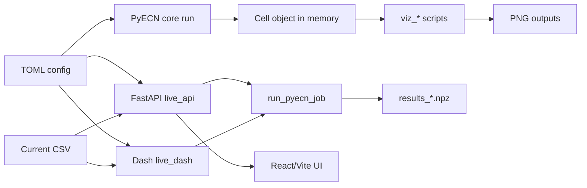

# PyECN (ThinkClock fork)

PyECN is a Python-based equivalent circuit network (ECN) framework for modeling lithium-ion batteries. This repository (PyECN_ThinkClock) tracks the upstream solver and adds live visualization and browser tooling.

## What's in this fork

- Live browser visualization API (FastAPI) and React/Vite frontend (see `web/`)
- Dash-based live visualization UI (`pyecn.browser_visualizations.live_dash`)
- Live thermal visualizer for unrolled electrodes (`pyecn/visualization_modules/viz_live_thermal.py`)
- Extra example configs in `pyecn/Examples/`

## Installation

Python 3.10 is required.

<details>
  <summary>Linux/macOS</summary>

  1. Clone the repository and enter the directory:
  ```bash
  git clone https://github.com/ImperialCollegeLondon/PyECN.git
  cd PyECN
  ```

  2. Create and activate a virtual environment:
  ```bash
  python -m venv .venv
  source .venv/bin/activate
  ```

  3. Install the dependencies:
  ```bash
  pip install -U pip
  pip install -r requirements.txt
  ```
</details>

<details>
  <summary>Windows</summary>

  1. Clone the repository and enter the directory:
  ```bat
  git clone https://github.com/ImperialCollegeLondon/PyECN.git
  cd PyECN
  ```

  2. Create and activate a virtual environment:
  ```bat
  python -m venv .venv
  .venv\Scripts\activate.bat
  ```

  3. Install the dependencies:
  ```bat
  pip install -U pip
  pip install -r requirements.txt
  ```
</details>

Optional developer tools:

```bash
pip install -r dev-requirements.txt
```

For the React/Vite frontend, install Node dependencies in `web/` (see Live browser visualization below).

## Quickstart (first run)

Run the full visualization suite to confirm your environment is working:

```bash
python pyecn/visualization_modules/viz_all.py
```

Expected results:
- Console summary with cell name, time steps, and data ranges
- PNG plots written to the current directory (or to the output directory you pass)

## Running PyECN

Config paths are resolved relative to the `pyecn/` folder.

```bash
# Run with a default config
python -m pyecn pouch.toml

# Run with another built-in config
python -m pyecn cylindrical.toml

# Run with an example config
python -m pyecn Examples/pouch_Fig_4a.toml
```

PyECN can also be run in an interactive Python session:

```bash
python
>>> import pyecn
>>> pyecn.run()
Enter config file name:
pouch.toml
```

## Inputs and outputs

Inputs:
- TOML config files live under [pyecn](pyecn/) and [pyecn/Examples](pyecn/Examples); `python -m pyecn` expects paths relative to [pyecn](pyecn/).
- External current profiles are CSV files referenced by `operating_conditions.I_ext_fpath` or uploaded in the live UI.
- LUT files referenced by configs live under [pyecn/Input_LUTs](pyecn/Input_LUTs).

Outputs:
- Core runs keep results in memory; plotting and postprocessing behavior is controlled by the `postprocessing` section in the TOML.
- Visualization scripts write PNGs to the output directory you pass (default: current working directory).
- The live API stores uploads and generated results under [pyecn/browser_visualizations/uploads](pyecn/browser_visualizations/uploads) as `run_*.toml` and `results_*.npz`.

### Sample config snippet

Minimal example (from [pyecn/pouch.toml](pyecn/pouch.toml)):

```toml
[model]
Model = "EandT"
ECN_method = "Neo"
nx = 7
ny = 7
nstack = 3
nRC = 2

[operating_conditions]
C_rate = 1
I_ext_fpath = ""
dt = 1
SoC_initial = 1
Current_direction = 1
V_highlimit_single = 4.2
V_lowlimit_single = 2.7

[cell]
Form_factor = "Pouch"
Eparam = "Pouch_Cell1"
Cells_name = ["cell_1"]

[postprocessing]
PostProcessor = "Yes"
Visualisation_method = "mayavi"
Temp_levels = 40
Temp_min = 15.0
Temp_max = 35.0
```

## Visualization modules

PyECN_ThinkClock includes comprehensive visualization modules for post-processing simulation results.

### Individual visualization modules

- **Temperature visualizations** (`pyecn/visualization_modules/viz_temperature.py`)
  - Average temperature vs time
  - Min/max temperature vs time
  - Temperature delta and standard deviation
  - Unrolled jellyroll temperature distribution (cylindrical cells)
  - Combined temperature plots

- **Time-series visualizations** (`pyecn/visualization_modules/viz_timeseries.py`)
  - Cell voltage vs time
  - Current vs time
  - State of Charge (SoC) vs time
  - Combined time-series plots

- **2D spatial visualizations** (`pyecn/visualization_modules/viz_spatial_2d.py`)
  - Temperature 2D heatmaps
  - SoC 2D spatial distribution
  - Voltage 2D heatmaps
  - Current density 2D heatmaps
  - Combined spatial plots

### Live thermal visualization

Real-time thermal visualization for unrolled electrodes:

```bash
python pyecn/visualization_modules/viz_live_thermal.py
python pyecn/visualization_modules/viz_live_thermal.py Examples/pouch_Fig_4a.toml
```

See `pyecn/visualization_modules/README_live_thermal.md` for full usage.

### Complete visualization suite

Run all visualizations from a single simulation using `viz_all.py`:

```bash
# Default configuration
python pyecn/visualization_modules/viz_all.py

# Custom configuration file
python pyecn/visualization_modules/viz_all.py config.toml

# Custom configuration and output directory
python pyecn/visualization_modules/viz_all.py config.toml output_folder
```

This generates 15+ visualization files including:
- 6 temperature plots
- 4 time-series plots
- 5 spatial 2D heatmaps

**Features:**
- Single simulation run for all visualizations
- Automatic extraction of parameters from TOML config files
- Customizable output directories
- Matplotlib-based plots (PNG export, 300 DPI)
- Mayavi 3D visualization support for spatial temperature distributions

## Live browser visualization (ThinkClock)

### Architecture overview



### Option A: FastAPI + React/Vite frontend (recommended)

1. Start the API server (from the repo root):

```bash
python -m pyecn.browser_visualizations.live_api
```

The API runs at http://127.0.0.1:8000.

2. Start the Vite dev server (from the repo root):

```bash
cd web
npm install
npm run dev
```

The frontend proxies `/api` to http://127.0.0.1:8000. See `web/README.md` for details.

### Frontend build and preview

```bash
cd web
npm run build
npm run preview
```

Vite prints the local preview URL in the terminal.

### Option B: Dash-only UI

```bash
python -m pyecn.browser_visualizations.live_dash
```

Open http://127.0.0.1:8050/ in your browser.

### API cheat sheet

Base URL: http://127.0.0.1:8000

- GET /api/health
- GET /api/sim/status
- GET /api/sim/log
- POST /api/sim/run (form fields: config, current, measured, rct_percent)
- POST /api/results/load (form fields: results, measured)
- GET /api/plots/frame?time_index=0&rct_index=0

Examples:

```bash
curl http://127.0.0.1:8000/api/health
curl -X POST http://127.0.0.1:8000/api/sim/run -F "config=@pyecn/Examples/pouch_Fig_4a.toml"
curl -X POST http://127.0.0.1:8000/api/sim/run -F "config=@pyecn/Examples/pouch_Fig_4a.toml" -F "current=@pyecn/training_daq_20260207_160608_cell1_0001.csv" -F "rct_percent=5"
curl -X POST http://127.0.0.1:8000/api/results/load -F "results=@path/to/results.npz"
```

## Environment variables

- `PYECN_LIVE_MAX_STEPS` (default 5000): maximum time steps saved in live results; set to 0 to disable downsampling.
- `PYECN_RCT_PCT`: apply a +/- percent random spread to Rct values across RC elements (live API also accepts `rct_percent`).
- `PYECN_RCT_SEED`: seed for deterministic Rct randomization.

## Performance tips and known limitations

- Large models can make the live UI slow; reduce `nt`, downsample with `PYECN_LIVE_MAX_STEPS`, or increase `frame_skip` in live thermal.
- `viz_all.py` uses placeholder 2D spatial data; for real spatial maps use the live UI or [pyecn/visualization_modules/viz_spatial_2d.py](pyecn/visualization_modules/viz_spatial_2d.py).
- Mayavi plots require a local GUI and can be slow on remote or headless setups; disable Mayavi in the config for headless runs.
- Vite dev server proxies to port 8000; update [web/vite.config.js](web/vite.config.js) if you change the API port.

## Troubleshooting

- Config file not found or prompt repeats: run from the repo root and pass a path relative to [pyecn/](pyecn/), for example `python -m pyecn Examples/pouch_Fig_4a.toml`.
- Mayavi or VTK import errors, or blank 3D figures: reinstall `mayavi`, `vtk`, and `pyqt5` in the same environment; for headless runs, disable Mayavi plots in the config.
- Live API shows no plots: ensure a simulation finished or results were loaded; check `http://127.0.0.1:8000/api/health` and the run log in the UI.
- Frontend cannot reach the API: start `python -m pyecn.browser_visualizations.live_api` and confirm port 8000; if you changed it, update the dev proxy in [web/vite.config.js](web/vite.config.js).
- Video export fails in live thermal: install ffmpeg and see [pyecn/visualization_modules/README_live_thermal.md](pyecn/visualization_modules/README_live_thermal.md).

## Citing PyECN

If you use PyECN in your work, please cite:

Li, S., Rawat, S. K., Zhu, T., Offer, G. J., & Marinescu, M. (2023). Python-based Equivalent Circuit Network (PyECN) Modelling Framework for Lithium-ion Batteries. Engineering Archive. DOI: 10.31224/2972.

You can also use the machine-readable metadata in `CITATION.cff`.

BibTeX:

```
@article{pyecn2023,
  title = {Python-based Equivalent Circuit Network (PyECN) Modelling Framework for Lithium-ion Batteries},
  author = {Li, Shen and Rawat, Sunil Kumar and Zhu, Tao and Offer, Gregory J and Marinescu, Monica},
  year = {2023},
  publisher = {Engineering Archive},
  doi = {10.31224/2972}
}
```

## Contributing to PyECN

Contributions are welcome. Please open an issue or pull request with a clear description of the change.

## License

PyECN is fully open source. For more information about its license, see `LICENSE.md`.

## Contributors

- Shen Li: Conceptualisation, methodology, creator and lead developer of PyECN, writing and review;
- Sunil Rawat: Contributor of PyECN, discussion, writing and review;
- Tao Zhu: Contributor of PyECN, discussion, writing and review;
- Gregory J Offer: Conceptualisation, funding acquisition, supervision, writing – review & editing;
- Monica Marinescu: Conceptualisation, funding acquisition, supervision, writing – review & editing;
